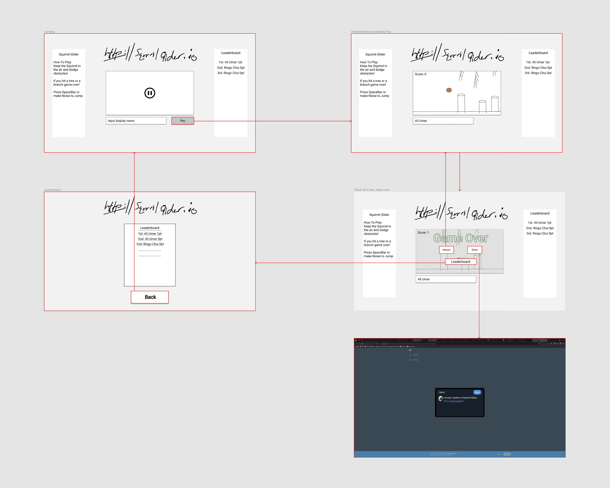

# Squirrel-Glider1012

## Name of the Team

MushroomApplePi

## Members of the Team

Ringo Chui, Ali Umar 

## Emails

Ringo Chui: rchui3@my.yorku.ca
Ali Umar:   aumar3@my.yorku.ca

## Student #

Ringo Chui: 216801326
Ali Umar:   219000538

## Title of the Project

Squirrel Glider

## Description

We are making an arcade web game that allows you to control a squirrel and guide him around trees. If you pass a tree you will get +1 score. The game ends when you hit a tree. (Similar to flappy bird) The twist of the game is that you will be using your voice via the web speech browser API. The squirrel will be falling unless the user makes noise to glide upwards. If we have time we will add additional special abilities, when you say a keyword it will be activated (e.g. "BOOST", "GHOST", etc.). The backend will be used for a leaderboard.

## Requirements:

1.	Before the game starts, the user will be given a textbox and able to type a display name
2.	To play the game, keyboard key “spacebar” will be the primary input
3.	Alongside the spacebar, the browser will ask for permissions to the microphone so your voice may also be used as input
4.	The background will be scrolling during the game at a fixed scroll rate
5.	The player will always be affected by gravity and always falling to the floor during the game
6.	The tree heights will be randomized within reason so that the squirrel has room to pass
7.	Once the player has passed a tree, the score will be incremented by 1 and shown on the top left
8.	However, if the player collides with a tree edge or falls to the ground, the game will end, and you score will be shown
9.	You will be prompted to play again, share, or check leaderboards
10.	The leaderboard must be persistent and will be provided by the NodeJS backend
11.	After the game, the user's score will be added to the leaderboard

## If time persist:
1.	Caching the player’s best score for next time they play the game
2.	Special abilities that will be activated via voice or another keyboard input
3.	GHOST Ability: Able to go through trees for 3 seconds -> Cooldown 30 seconds
4.	BOOST Ability: Gives the player 1 dash -> Cooldown 30 seconds
5.	CHOP Ability: Gets rid of all trees on the screen -> Cooldown 30 seconds

## Wireframes:

